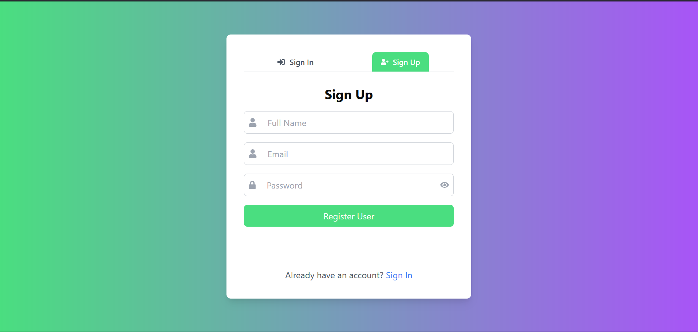

# AI Resume Builder 🚀

AI Resume Builder is a sophisticated web application that leverages artificial intelligence to help users craft professional resumes. The application features an intuitive interface, AI-powered content generation, and robust backend services for secure data management.

## 📌 Table of Contents  

- [Features](#features)
- [Tech Stack](#tech-stack)  
- [Quick Start](#quick-start)
- [Docker Deployment](#docker-deployment-recommended)
- [Installation](#installation)
  - [Setup with Docker](#setup-with-docker)  
  - [Setup without Docker](#setup-without-docker)
- [Environment Configuration](#environment-configuration)
- [Startup Scripts](#startup-scripts)
- [Recent Improvements](#recent-improvements)
- [Screenshots](#screenshots)

---

## ✨ Features

### 1. 🔒 Secure User Authentication  
- Custom authentication with **bcrypt** password hashing  
- **JWT-based** session management  

### 2. 🏠 User Dashboard  
- View and manage previous resume versions
- Loading skeletons for better UX
- Empty state handling  

### 3. 🎨 Customizable Templates  
- Choose from **21 professional theme colors**
- Real-time preview updates
- Consistent styling across all sections  

### 4. 🤖 AI-Powered Features  
- Smart resume content suggestions for Experience, Projects, and Education
- Context-aware AI generation using professional summary and skills
- Automatic bullet point formatting

### 5. ⌨️ Enhanced User Experience
- **Keyboard shortcuts** (Ctrl/Cmd + Arrow keys) for navigation
- **Auto-save functionality** with 2-second debounce
- **Input validation** for email, phone, and dates
- Better toast notifications

### 6. 🔍 Live Preview  
- See real-time resume updates as you type
- Conditional preview (hide on final preview tab)
- HTML content rendering with proper formatting

### 7. 📄 Export Options  
- Download resumes in **PDF format**
- **Export to Word (.docx)** format
- Share resume with others

---

## 🛠️ Tech Stack

- **Frontend:** React 18.3.1, Vite 5.3.1, TailwindCSS 3.4.4, Redux Toolkit
- **Backend:** Node.js (ESM), Express 4.19.2, MongoDB Atlas
- **AI:** Google Generative AI (Gemini 2.5 Flash)
- **Authentication:** JWT, bcrypt
- **Additional:** Docker support, Nodemon, React Router, Axios

---

## 🚀 Quick Start

### Easiest Way (Windows)
**Just double-click `start-all.bat` in the project root!**

This will:
- ✅ Automatically clean up ports 5001 and 5173
- ✅ Start Backend server in a new window
- ✅ Start Frontend server in a new window
- ✅ No more port conflict errors!

### Alternative Methods

#### Using NPM Scripts (with automatic port cleanup)
```bash
# Backend only
cd Backend
npm run dev:clean

# Frontend only
cd Frontend
npm run dev:clean
```

#### Using PowerShell Script
```powershell
# From project root
.\start-all.ps1
```

---

## 🐳 Docker Deployment (Recommended)

### Production (One-Click)
```bash
# Double-click this file
docker-start-prod.bat

# Or manually
docker-compose up -d --build
```
**Access:** http://localhost (Frontend) | http://localhost:5001 (Backend)

### Development (Hot-Reload Enabled)
```bash
# Double-click this file
docker-start-dev.bat

# Or manually
docker-compose -f docker-compose.dev.yml up -d --build
```
**Access:** http://localhost:5173 (Frontend) | http://localhost:5001 (Backend)

### Why Use Docker?
- ✅ **One-command deployment** - No dependency installation needed
- ✅ **Consistent environment** - Works the same everywhere
- ✅ **Production-ready** - Optimized builds with Nginx
- ✅ **Isolated services** - No port conflicts
- ✅ **Easy scaling** - Deploy to any cloud platform

**Complete guide:** See [DOCKER_GUIDE.md](DOCKER_GUIDE.md) for detailed documentation

---

## 📦 Installation

### Prerequisites
- Node.js (v16 or higher)
- MongoDB Atlas account or local MongoDB
- Google Gemini API key

### 1️⃣ Clone the Repository
```bash
git clone https://github.com/yourusername/ai-resume-builder.git
cd ai-resume-builder
```

### 2️⃣ Environment Configuration

#### 🔹 Backend (`Backend/.env`)  

Create a `.env` file inside the `Backend/` directory:

```env
MONGODB_URI=your_mongodb_connection_string
PORT=5001
JWT_SECRET_KEY=your_secret_key_here
JWT_SECRET_EXPIRES_IN=1d
NODE_ENV=development
ALLOWED_SITE=http://localhost:5173
GEMINI_API_KEY=your_gemini_api_key_here
```

#### 🔹 Frontend (`Frontend/.env.local`)  

Create a `.env.local` file inside the `Frontend/` directory:

```env
VITE_GEMINI_API_KEY=your_gemini_api_key_here
VITE_APP_URL=http://localhost:5001/
```

> **Note:** A `.env.example` file is provided in the Backend directory for reference.

---

### 🚀 Setup with Docker

1. Navigate to the backend directory:
   ```bash
   cd Backend/
   ```

2. Run the Docker Compose file:
   ```bash
   docker-compose up -d
   ```

3. Start the frontend server:
   ```bash
   cd ../Frontend/
   npm install
   npm run dev
   ```

---

### 🔧 Setup without Docker (Recommended)

#### Install Dependencies

```bash
# Install Backend dependencies
cd Backend
npm install

# Install Frontend dependencies
cd ../Frontend
npm install
```

#### Start the Application

**Option 1: Use the startup scripts (No port conflicts!)**
```bash
# From project root
start-all.bat   # Windows (double-click or run from terminal)
# or
.\start-all.ps1 # PowerShell
```

**Option 2: Manual start with automatic port cleanup**
```bash
# Terminal 1 - Backend
cd Backend
npm run dev:clean

# Terminal 2 - Frontend
cd Frontend
npm run dev:clean
```

**Option 3: Traditional method (may have port conflicts)**
```bash
# Terminal 1 - Backend
cd Backend
npm run dev

# Terminal 2 - Frontend
cd Frontend
npm run dev
```

#### Access the Application
- **Frontend:** http://localhost:5173
- **Backend API:** http://localhost:5001

---

## 🔄 Startup Scripts

The project includes automated startup scripts that solve port conflict issues permanently:

| Script | Description |
|--------|-------------|
| `start-all.bat` | **Main startup script** - Double-click to start both servers |
| `start-all.ps1` | PowerShell version of the main script |
| `Backend/start.ps1` | Start Backend only with port cleanup |
| `Frontend/start.ps1` | Start Frontend only with port cleanup |

**Why use these scripts?**
- ✅ Automatically kills processes on ports 5001 & 5173
- ✅ No more "EADDRINUSE" errors
- ✅ Clean start every time
- ✅ Opens servers in separate windows

See `STARTUP_GUIDE.md` for detailed documentation.

---

## 🆕 Recent Improvements

### Latest Updates (v2.0)
- ✅ **Education AI Generator** - AI-powered description generation for education section
- ✅ **Auto-save** - Automatic saving with 2-second debounce in Summary section
- ✅ **Export to Word** - Download resumes as .docx files
- ✅ **Keyboard Shortcuts** - Navigate with Ctrl/Cmd + Arrow keys
- ✅ **Input Validation** - Email, phone, and date validation
- ✅ **Loading Skeletons** - Better loading states on dashboard
- ✅ **Enhanced Theme Colors** - 21 professional color options
- ✅ **Real-time Preview** - Instant updates as you type
- ✅ **Better Toast Messages** - More informative notifications
- ✅ **CSS Improvements** - Consistent styling across all sections

See `IMPROVEMENTS.md` for complete changelog.

---

## 📸 Screenshots

### Authentication
  
  

### Dashboard & Templates
  
  

### AI Features
  

### Live Preview & Export
  
  

---

## 📝 Additional Documentation

- **STARTUP_GUIDE.md** - Detailed startup script documentation
- **QUICK_START.md** - Quick reference for starting the application
- **IMPROVEMENTS.md** - Complete changelog of recent improvements
- **DEPLOYMENT.md** - Deployment guidelines

---

## 🤝 Contributing

Contributions are welcome! Please feel free to submit a Pull Request.

---

## 📄 License

This project is open source and available under the [MIT License](LICENSE).

---

## 🙋‍♂️ Support

For issues and questions, please open an issue on GitHub.

---

**Made with ❤️ using React, Node.js, and AI**